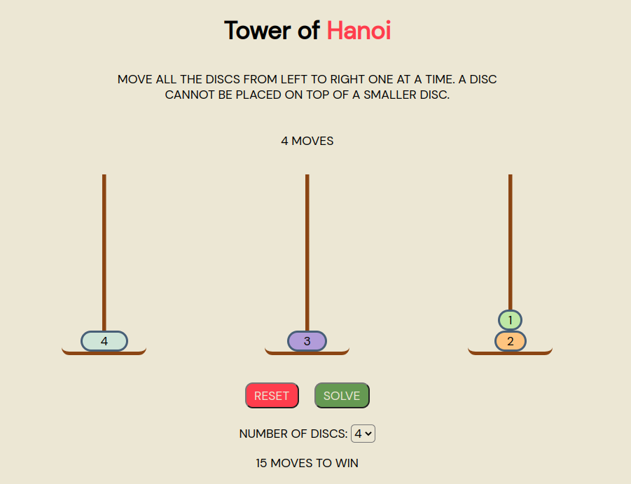

## Tower of Hanoi
Tower of Hanoi is a mathematical puzzle game consisting of three towers and a number of discs of various widths. The game begins with the discs stacked by decreasing size on a single tower, the smallest at the top. The objective is to move all the discs to the third tower, so that they are stacked in the same order. There are three rules:

1. Only one disc can be moved at a time
2. Every move involves taking the top disc from one of the towers and placing it on top of another tower
3. No disc can be put on top of a smaller disc

### Screenshots

### Technologies
* JavaScript
* HTML
* CSS

### Installation Instructions
Follow [this link](https://google.com) to play the game in your browser.

### User Stories

### Wireframes

### Unsolved Problems / Major Hurdles