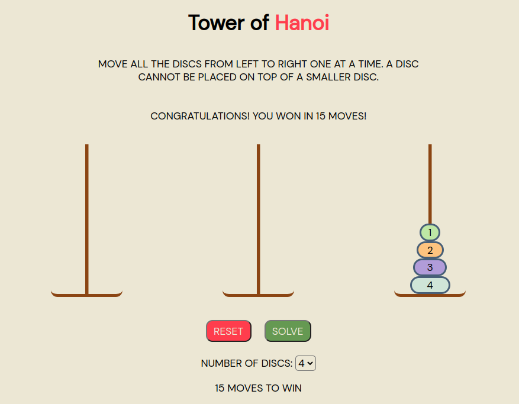
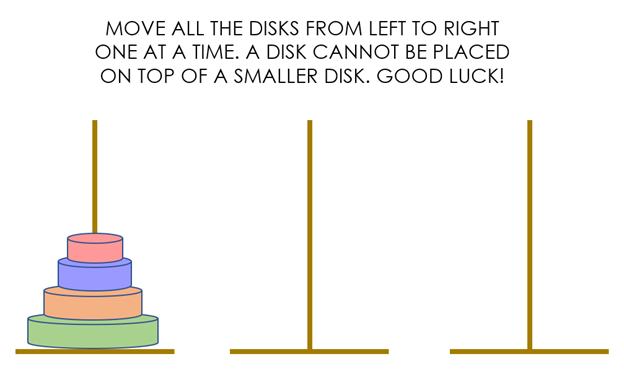

## Tower of Hanoi
Tower of Hanoi is a mathematical puzzle game consisting of three towers and a number of discs of various widths. The game begins with the discs stacked by decreasing size on a single tower, the smallest at the top. The objective is to move all the discs to the third tower, so that they are stacked in the same order. There are three rules:

1. Only one disc can be moved at a time
2. Every move involves taking the top disc from one of the towers and placing it on top of another tower
3. No disc can be put on top of a smaller disc

In my app, users can play Tower of Hanoi, reset the game, and select anywhere between 3 and 8 discs with which to play. Once you select a number of discs from the dropdown, the screen will display the minimum number of moves needed to win.

### Screenshots

### Technologies
* JavaScript
* HTML
* CSS

### Installation Instructions
Follow [this link](https://google.com) to play the game in your browser.

### User Stories
- As a player, I want to be able to select discs and move them around so I can play the game.
- As a player, I want the game to prevent me from making invalid moves so I don't break the rules.
- As a player, I want the game to track the number of moves so I can see my game stats.
- As a player, I'd like to be able to restart the game so I can keep practicing my skills.
- As a player, I'd like to be notified when I win so I can celebrate.
- As a player, I'd like to control the number of discs so I can control the difficulty.
- As a player, I want the game to self-solve so I can see how it's done if I can't figure it out.

### Wireframes

### Unsolved Problems / Major Hurdles

