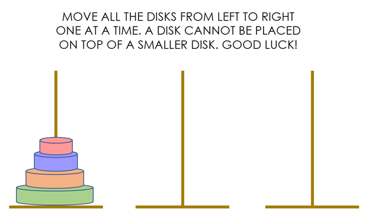
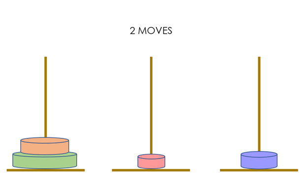
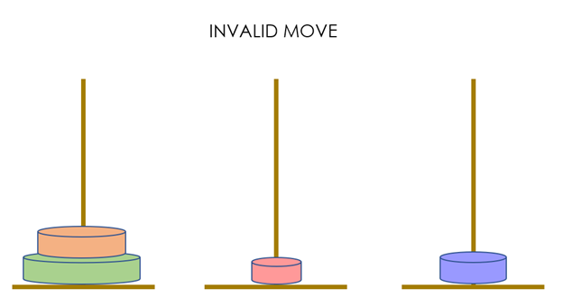
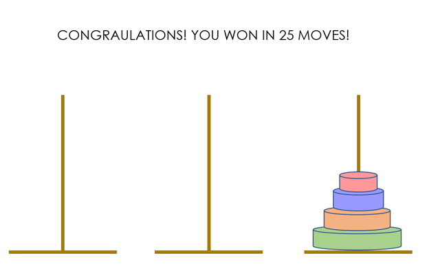

## Tower of Hanoi

## Description

Tower of Hanoi is a mathematical puzzle game consisting of three rods and a number of disks of various widths. The game begins with the disks stacked by decreasing size on a single rod, the smallest at the top. The objective is to move all the disks to the third rod, so that they are stacked in the same order. There are three rules:

1. Only one disk can be moved at a time
2. Every move involves taking the top disk from one of the stacks and placed it on top of another stack
3. No disk can be put on top of a smaller disk

## Wire Frames

## User Stories

#### MVP Goals
- As a player, I want to be able to select disks and move them around so I can play the game.
- As a player, I want the game to prevent me from making invalid moves so I don't break the rules.
- As a player, I want the game to track the number of moves so I can see my game stats.
- As a player, I'd like to be able to restart the game so I can keep practicing my skills.
- As a player, I'd like to be notified when I win so I can celebrate.

#### Stretch Goals
- As a player, I want the game to self-solve so I can see how it's done if I can't figure it out.
- As a player, I'd like to control the number of disks so I can control the difficulty.
- As a player, I'd like to see how much time has elapsed so I can measure if my speed is improving.